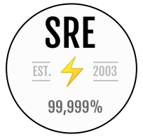

# sre-swe-reading-list 

A repository to track books I'm reading at the moment and notes, references.

#### What is Site Reliability Engineering?
> "Fundamentally, it's what happens when you ask a software engineer to design an operations function." - Ben Treynor Sloss, VP Google Engineering, founder of Google SRE

## Books [General SWE]
- [x] [A Philosophy of Software Design](philosophy-of-software-design/notes.md)

## Books [SRE]
